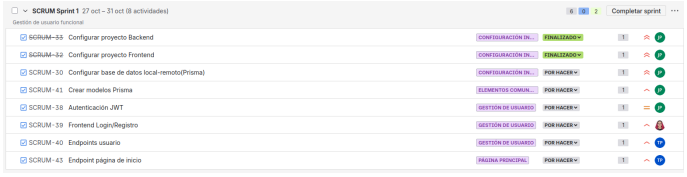
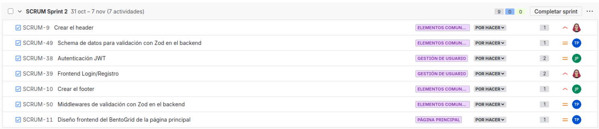
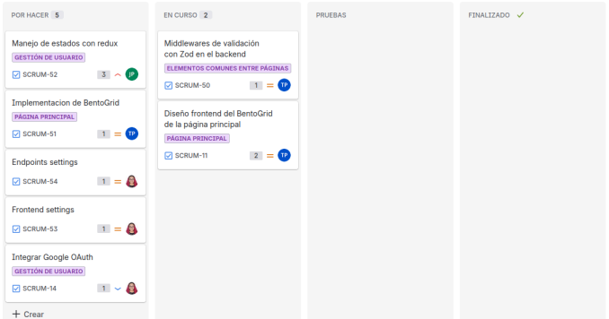
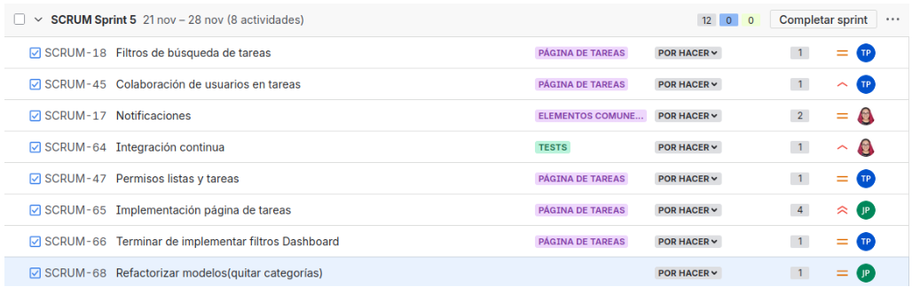
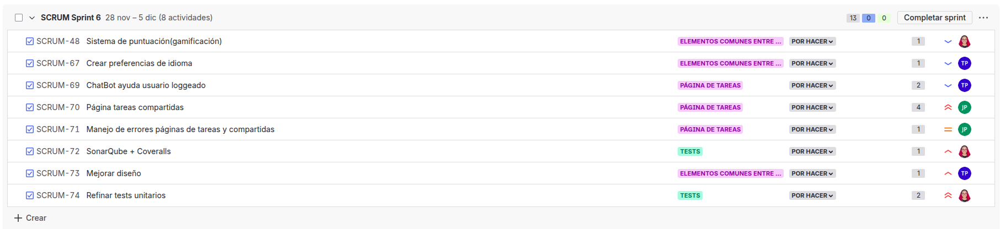

# TaskGrid

El **Gestor de Tareas Colaborativo** es una aplicación web fullstack diseñada para facilitar la organización personal y el trabajo en equipo. Inspirada en la simplicidad de _Google Tasks_ y la versatilidad visual de _Trello_, esta plataforma permite a los usuarios crear, organizar y compartir tareas de manera intuitiva y eficiente..

## Características Principales

- **Gestión de tareas personalizada**: Crea, edita y organiza tus tareas con facilidad
- **Colaboración en tiempo real**: Comparte tareas y listas con otros usuarios
- **Sistema de autenticación seguro**: Registro tradicional y autenticación con Google OAuth
- **Interfaz visual atractiva**: Diseño tipo BentoGrid para una experiencia de usuario moderna
- **Sistema de gamificación**: Gana puntos al completar tareas y mantén tu motivación
- **Notificaciones inteligentes**: Recibe avisos sobre actualizaciones en tareas compartidas
- **Filtros avanzados**: Búsqueda y filtrado potente para encontrar tus tareas rápidamente
- **Dashboard resumen**: Visualiza el estado de tus tareas de un vistazo
- **Soporte multiidioma**: Personaliza tu experiencia en tu idioma preferido
- **ChatBot integrado**: Asistente virtual para ayudarte a usar la plataforma
- **Gestión de permisos**: Control granular sobre quién puede ver y editar tus tareas

---

## Autores

---

## Insignias de estado

---

## Gestión del Proyecto por Sprints

### Sprint 1 - Configuración Inicial y Primeros Pasos

- Configuración del entorno backend con Node.js y Express
- Configuración del entorno frontend con React y Vite
- Configuración de base de datos local y remota mediante Prisma ORM
- Diseño y creación de modelos de datos en Prisma
- Implementación de sistema de autenticación JWT
- Desarrollo de interfaz frontend para Login y Registro
- Desarrollo de endpoints REST para gestión de usuarios
- Implementación de endpoint para la página de inicio

### Sprint 2 – Estructura Visual y Validación

- Diseño e implementación del header de la aplicación
- Diseño e implementación del footer de la aplicación
- Creación de schemas de validación con Zod en el backend
- Desarrollo de middlewares de validación con Zod en el backend
- Finalización del sistema de autenticación JWT
- Completado del frontend para Login y Registro
- Diseño de la interfaz del BentoGrid para la página principal

### Sprint 3 – Integración Visual y Estado

- Implementación de Redux para el manejo centralizado del estado
- Desarrollo completo del componente BentoGrid
- Creación de endpoints para la configuración de usuario
- Desarrollo del frontend de configuración de usuario
- Integración de Google OAuth para autenticación alternativa
- **Pendientes para el siguiente sprint**:
  - Finalización de middlewares de validación con Zod en backend
  - Completar diseño del BentoGrid de la página principal

### Sprint 4 – Tests y Funcionalidades Clave

- Desarrollo completo del frontend de la página de tareas
- Implementación de tests unitarios (UT) en el frontend
- Desarrollo de tests End-to-End (E2E) con Selenium
- Implementación de tests unitarios (UT) en el backend
- Sistema robusto de manejo y presentación de errores al usuario
- Desarrollo de funciones de filtrado para el dashboard resumen
- Implementación de validación con Zod en el frontend

### Sprint 5 – Finalización de Funcionalidades

- Desarrollo de filtros de búsqueda avanzada de tareas
- Implementación del sistema de colaboración entre usuarios
- Sistema completo de notificaciones en tiempo real
- Configuración de integración continua con GitHub Actions
- Desarrollo del sistema de permisos para listas y tareas
- Finalización de la implementación de la página de tareas
- Completado de los filtros del Dashboard
- Refactorización de modelos de datos (eliminación de categorías)
- _Inconveniente:_ No se pudo completar la integración con Coveralls debido a falta de permisos para hacer el repositorio público. Solicitud de acceso pendiente por parte de la organización de la asignatura.

### Sprint 6 – Gamificación y Refinamiento

- Sistema de puntuación y gamificación
- Preferencias de idioma para usuarios autenticados
- ChatBot de ayuda para usuarios autenticados
- Implementación de página de tareas compartidas
- Gestión de errores en páginas de tareas y compartidas
- Integración de SonarQube y Coveralls para análisis de calidad
- Refinamiento del diseño visual
- Optimización de tests unitarios (UT)

---

## Stack Tecnológico

